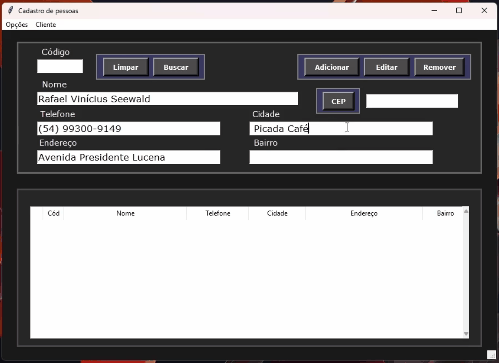

# Customer-App <h6>ENGLISH</h6>

I made an exe app for customer registering, capable of using CEP api and providing a PDF with the client data
If you want only the app you have to unzip the "ClientRegistering APP.zip"

<h1 align="center">
</img>
</h1>

<h3>It's an exec that uses quite data fields:</h3>

ID - NAME - NUMBER - ADDRESS - CITY - DISTRICT

 

<h2>Button features:</h2>
<li>"CLEAN" - Clean all the data fields</li>
<li>"SEARCH" - In the name field you write "%" then what you remember from the name and press the search button. It will show all the names it found</li>
<li>"ADD" - Gonna add a customer in the database</li>
<li>"EDIT" - You can edit any data from a user in the app</li>
<li>"REMOVE" - Delete a customer from the database</li>
<li>"CEP" - You write the CEP and if it exists, it will automatically fill the Address, City and District fields</li>

In the Menu at the top of the window you can create a PDF about the selected person:
                          "Cliente" -> "Gerar PDF"

  <footer>
     
    <a href="https://www.instagram.com/vinyyboy_seewald/" target="_blank"></img></a>
    <h5>| Made with ❤️ by: Rafael Seewald👋|</h5>
  </footer>

